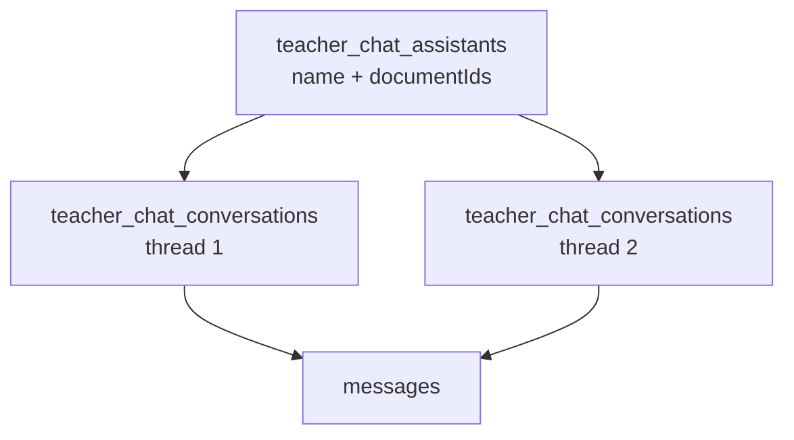

# Eduator AI Platform — Weekly Delivery Report (Third-party API & Integration)

**Report:** 2 (sprint focus)  
**Reporting period:** **11 May 2026 – 15 May 2026** (~4–5 days of active delivery)  
**Version span:** **0.2.0 → 0.3.0**  
**Companion doc:** [PROJECT_OVERVIEW_AND_REPORT 1.md](./PROJECT_OVERVIEW_AND_REPORT%201.md) — full platform map

> **Note:** If you created your first **HTTP API key** (`ed_…`) around this time, that marks when third-party testing began. **Never paste full API keys into reports or chat** — only store the prefix shown in the UI.

---

## Executive summary

From **12 May** through **15 May 2026**, the main engineering focus was making Eduator **integrable by external systems** (LMS, partner apps, Postman) while the **official web app** stayed on JWT login.

**Delivered in this window:**

1. **Third-party HTTP API keys** (`ed_…`) on protected `/v1/*` routes  
2. **Usage analytics** per key (`api_access_log` + school-admin **Usage** tab)  
3. **Per-user Gemini API keys** (encrypted; each operator’s own Google quota for AI)  
4. **In-app API documentation** for integrators (Keys & Docs — not login JWT)  
5. **AI Tutor** — assistants vs conversations, third-party sessions via **`conversation.id`**, API-key chat fixes  
6. **DB migrations** `005`–`012` supporting keys, logging, and chat  

Releases: [CHANGELOG.md](../CHANGELOG.md) **0.2.5** (14 May) through **0.2.9** (15 May); follow-up **0.3.0** (22 May) — pgvector RAG.

---

## 1. Strategic goal: third-party API (first priority)

| Before | After |
|--------|--------|
| Only JWT from web login | Partners use **`Authorization: Bearer ed_<secret>`** |
| No visibility into external traffic | **Usage** tab: per-key stats from `api_access_log` |
| Docs mixed web + integration | **Keys & Docs** = third-party only (`YOUR_API_KEY`) |
| Web traffic polluted metrics | Web sends **`X-Eduator-Client: web-app`** (excluded from Usage) |

**Who does what**

| Client | Auth | Usage logged as |
|--------|------|-----------------|
| Eduator web app (Next.js) | JWT + `X-Eduator-Client: web-app` | Not counted in integration Usage |
| Postman, LMS, scripts | HTTP API key `ed_…` | Per key in **API Integration → Usage** |

---

## 2. HTTP API keys (release **0.2.6**)

### Product

- School admin → **API Integration** → create/revoke keys (prefix shown; full secret once).
- Keys authenticate the same routes as JWT.

### Backend

- Table **`user_api_keys`** (migration `005_user_api_keys.sql`).
- Auth plugin accepts `ed_…` tokens and sets `request.authApiKeyId`.
- **`last_used_at`** updated when a key is used.

### API

- `GET /v1/users/me/api-keys` — list  
- `POST /v1/users/me/api-keys` — create (raw key in response once)  
- `DELETE /v1/users/me/api-keys/:id` — revoke  

---

## 3. Usage analytics (releases **0.2.5** – **0.2.7**)

### Database

| Migration | Purpose |
|-----------|---------|
| `006_api_access_log.sql` | Table **`api_access_log`**: `user_id`, method, path, status, timestamp |
| `007_api_access_log_api_key_id.sql` | Column **`api_key_id`** → attribute traffic to a specific HTTP key |

### Backend

- Fastify plugin **`api-access-log`** records successful authenticated responses.
- Skips: unauthenticated calls, `GET .../api-keys/usage` (no feedback loop), requests with **`X-Eduator-Client: web-app`**.

### API & UI

- `GET /v1/users/me/api-keys/usage?range=today|30d|all`
- Response includes totals, **`byKey`** breakdown, recent rows with optional **`apiKeyId`**
- Usage tab: **Today / Last 30 days / All**, key filter, **Other (login token)** bucket for JWT-only calls

---

## 4. Per-user Gemini API key (operator feature)

Each school admin can store **their own Google Gemini key** so AI generation and chat use **their** quota—not a single shared server key only.

### Flow

1. **School Admin → API Integration → Gemini Key** tab  
2. User pastes key → backend **encrypts** and stores (`user_ai_provider_keys`)  
3. On every AI route, backend **resolves** user key; if missing:

```json
{
  "error": "Gemini API key is missing for this user.",
  "code": "MISSING_GEMINI_API_KEY",
  "hint": "Open /school-admin/api-integration and save your Gemini API key."
}
```

### Applies to

- Lesson / exam / education-plan generation  
- AI Tutor chat messages  
- Other Gemini-backed `/v1/ai/*` routes  

Optional fallback: server env **`GOOGLE_GEMINI_API_KEY`** when configured.

### API

- `GET /v1/users/me/ai-keys/gemini` — status (never returns full key)  
- `PUT /v1/users/me/ai-keys/gemini` — save/update  
- `DELETE /v1/users/me/ai-keys/gemini` — remove  

---

## 5. Third-party API documentation (releases **0.2.7** – **0.2.9**)

### In-app (School admin → API Integration → Keys & Docs)

- Amber banner: **third-party only** — all curls use `YOUR_API_KEY`, not login JWT.
- Expanded examples: documents, lessons, exams, education plans, **AI tutor** (assistants + conversations).
- Quick-start blocks with copy-paste `curl` commands.
- EN + AZ via `teacherApiIntegration` in `apps/web-app/src/lib/i18n.ts`.

### Repository docs (updated for **0.3.0**)

| Document | Role |
|----------|------|
| [API_SUMMARY.md](./API_SUMMARY.md) | Short endpoint list + smoke checklist |
| `apps/backend/API_DOCUMENTATION.md` | Full prose reference |
| `apps/backend/openapi.yaml` | OpenAPI / Swagger |
| [TECHNICAL_SUMMARY.md](./TECHNICAL_SUMMARY.md) | Architecture + AI Tutor tables |

### API cleanup documented

- Removed unused **`subject`** and **`is_published`** from exams/lessons APIs and docs (DB columns may remain; not exposed).

---

## 6. Database work (migrations summary)

Run from `apps/backend`:

```bash
npm run db:migrate
```

| # | File | What it does |
|---|------|----------------|
| 005 | `user_api_keys.sql` | HTTP API keys for third-party auth |
| 006 | `api_access_log.sql` | Request logging for Usage |
| 007 | `api_access_log_api_key_id.sql` | Link log rows to API keys |
| 008 | `teacher_chat.sql` | Chat messages + initial conversation table |
| 009 | `teacher_chat_external_user.sql` | `external_user_id` (later moved to conversations in 012) |
| 010 | `teacher_chat_assistants.sql` | Split **assistants** vs **conversation threads** |
| 011 | `teacher_chat_assistants_repair.sql` | Repair orphaned messages after split |
| 012 | `external_user_on_conversations.sql` | `external_user_id` on **conversations** only |

---

## 7. AI Tutor (releases **0.2.8** – **0.2.9**)

### Problem we fixed

- UI treated “create bot” as one thing; database mixed **tutor config** and **chat thread**.
- Third-party chat failed (missing tables, no history, wrong scoping).

### Correct model (0.2.9)



| Layer | Meaning |
|-------|---------|
| **Assistant** | Configured tutor (name, core documents for RAG) |
| **Conversation** | One chat session / thread |
| **Message** | User + assistant turns in that thread |

### In-app UI

- **Column 1:** Create/list **assistants**  
- **Column 2:** **New chat** + list threads for selected assistant  
- **Column 3:** Messages + **short answer** checkbox (`shortAnswer`)  

### Third-party API flow

1. `POST /v1/ai/chat/assistants` → `assistant.id`  
2. `POST /v1/ai/chat/assistants/:id/conversations` → optional `externalUserId` → **`conversation.id`** (store per your end-user)  
3. `POST /v1/ai/chat/conversations/:id/messages` — only **`conversation.id`** needed afterward  

`externalUserId` is optional metadata on **conversations** (for listing/filter), not on assistants. In-app JWT threads always have `external_user_id = null`.

### Assistant API (new)

- `GET/POST/PATCH/DELETE /v1/ai/chat/assistants`  
- `GET/POST /v1/ai/chat/assistants/:assistantId/conversations`  
- `GET/PATCH/DELETE /v1/ai/chat/conversations/:id`  
- `POST /v1/ai/chat/conversations/:id/messages`  
- Legacy: `POST /v1/ai/chat/conversations` (assistant + first thread in one call)  

---

## 8. Day-by-day timeline (git history, this sprint)

| Date | Commits / theme |
|------|------------------|
| **12 May** | **Sprint start** — API Integration UI refactor; **user HTTP API keys** create/revoke; Gemini key overrides in lesson/media services; lesson media URLs for API consumers; API docs i18n (EN/AZ) |
| **13 May** | Education plan AI (sessions, normalization); lesson AI cleanup; content sanitization |
| **14 May** | **`api_access_log`** + Usage stats; web-app header `X-Eduator-Client`; document/education-plan/exam **API docs** expansion; release **0.2.5** |
| **15 May** | HTTP API key auth release **0.2.6**; Usage date ranges; third-party-only docs **0.2.7**; AI Tutor chat **0.2.8** / **0.2.9** (assistants, conversations, migrations 008–012) |

### Version tags in this period

| Version | Date (approx.) | Theme |
|---------|----------------|--------|
| **0.2.5** | 14 May | API access logging + Usage foundation |
| **0.2.6** | 15 May | HTTP API keys authenticate `/v1/*`; per-key Usage |
| **0.2.7** | 15 May | Third-party-only docs; removed unused exam/lesson fields |
| **0.2.8** | 15 May | AI Tutor DB + multi-turn chat + `externalUserId` |
| **0.2.9** | 15 May | Assistants vs conversations; `external_user_id` on threads |
| **0.3.0** | 22 May | pgvector RAG (`document_chunks`, HNSW index, migration 015); batch multi-doc retrieval |

---

## 11. Release **0.3.0** — pgvector RAG (22 May 2026)

Follow-up after the integration sprint: RAG was moved from JSONB + in-memory cosine similarity to **PostgreSQL pgvector** for production-scale concurrent usage.

| Before (≤0.2.9) | After (0.3.0) |
|-----------------|---------------|
| Embeddings in `documents.chunk_embeddings` JSONB | Indexed rows in **`document_chunks`** (`vector(768)`) |
| All vectors loaded into Node.js per query | **HNSW** approximate search in SQL |
| Multi-doc RAG = N sequential loops | **One SQL query** across documents |
| AI Tutor = 3× separate retrieve pipelines | **Batch `retrieveMany()`** |

**Ops:** install pgvector on PostgreSQL, run `npm run db:migrate` (includes `015_pgvector_document_chunks.sql`). Legacy JSONB embeddings backfill on first access.

Details: [TECHNICAL_SUMMARY.md](./TECHNICAL_SUMMARY.md) — RAG / Vector Search; [CHANGELOG.md](../CHANGELOG.md) **0.3.0**.

---

## 9. Verification checklist (for QA / demo)

1. **API key:** Create key in API Integration → call `GET /v1/documents` with `Bearer ed_…` (no `X-Eduator-Client`).  
2. **Usage:** Same call appears under Usage for that key; web browsing does not inflate counts.  
3. **Gemini:** Without user key, AI route returns `MISSING_GEMINI_API_KEY`; after save, generation works.  
4. **AI Tutor (web):** Create assistant → New chat → send message (toggle short answer).  
5. **AI Tutor (API):** Create assistant → conversation → message with API key.  
6. **DB:** `npm run db:migrate` through `015` on target environment (pgvector required for RAG).  

Details: [API_SUMMARY.md](./API_SUMMARY.md) — Quick Verification Checklist.

---

## 10. What’s next (suggested)

- Partner pilot with one `ed_` key + documented tutor flow (`conversation.id` per student).  
- Production env: encrypted Gemini keys, `db:migrate`, monitor `api_access_log` size.  
- Optional: rate limits per API key, webhook on document processing complete.  

---

## Related files

| File | Topic |
|------|--------|
| [PROJECT_OVERVIEW_AND_REPORT 1.md](./PROJECT_OVERVIEW_AND_REPORT%201.md) | Full platform overview |
| [CHANGELOG.md](../CHANGELOG.md) | Release-by-release changes |
| [API_SUMMARY.md](./API_SUMMARY.md) | API groups |
| [TECHNICAL_SUMMARY.md](./TECHNICAL_SUMMARY.md) | Technical architecture |
| `apps/web-app/src/app/school-admin/api-integration/` | Keys, Usage, Gemini, Docs UI |

---