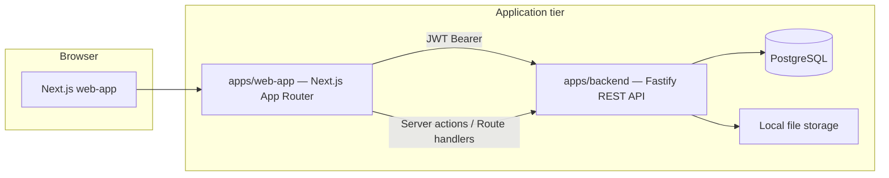

# Eduator AI Platform — Overview & Delivery Report

**Version:** 0.2.5  
**Audience:** Engineering, product, and stakeholders who need one place to understand **what the system is**, **how it works**, **where APIs live**, and **what shipped recently**.

For deeper dives, use the linked docs at the end — this file is the map, not a duplicate of every endpoint.

---

## 1. What this product is

**Eduator** is an AI-assisted education platform: operators (school admins) upload teaching materials, generate structured **lessons**, **exams**, and **education plans**, chat with an **AI tutor**, and integrate via **API keys**. **Platform owners** approve and manage users.

---

## 2. High-level architecture

| Layer | Responsibility |
|--------|----------------|
| **web-app** (`apps/web-app`) | UI: auth, school-admin, platform-owner; proxies some file/API calls; locale + i18n. |
| **backend** (`apps/backend`) | Auth, users, documents, RAG pipeline, AI generation (lessons/exams/plans), chat, encrypted Gemini keys. |
| **PostgreSQL** | Users, sessions/tokens, documents metadata, chunks/embeddings refs, lessons, exams, plans, **api access log** (`api_access_log`), user API keys, encrypted Gemini keys. |
| **Local disk** | Uploaded documents and generated lesson media (see backend storage config). |

Canonical technical detail: [TECHNICAL_SUMMARY.md](./TECHNICAL_SUMMARY.md).

---

## 3. Repository layout (what lives where)

| Path | Role |
|------|------|
| `apps/web-app` | Next.js frontend (routes under `src/app`, shared libs under `src/lib`). |
| `apps/backend` | Fastify API, services (document RAG, lesson AI, etc.), OpenAPI. |
| `packages/` | Shared packages consumed by apps (if present in your checkout). |
| `docs/` | Human-written summaries (this file, API summary, decisions). |

**API contract source of truth:** `apps/backend/openapi.yaml`  
**Extended API prose:** `apps/backend/API_DOCUMENTATION.md`  
**Short API cheat sheet:** [API_SUMMARY.md](./API_SUMMARY.md)

---

## 4. Roles, routes, and main use cases

### 4.1 Roles

| Role (concept) | Typical UI area | Purpose |
|----------------|-----------------|---------|
| **School admin / operator** | `/school-admin/*` | Documents, lessons, exams, education plans, AI tutor chat, API integration (keys + usage). |
| **Platform owner** | `/platform-owner/*` | Dashboard, user list, approvals, user detail. |
| **Unauthenticated** | `/auth/login`, marketing/public pages | Login and public content. |

### 4.2 Primary use cases (operator)

1. **Document library** — Upload PDF/Word/text; backend extracts text, chunks, embeds, tracks quality; UI shows status and supports edit/info modals.
2. **Lesson generation** — Select documents + topic/options → AI generates lesson → persisted lesson with optional async audio.
3. **Exam generation** — Select documents + parameters → generated questions → save/edit exam.
4. **Education plans** — Create/generate structured plans from documents; view week-by-week content; edit/delete.
5. **AI Tutor chat** — Conversations and messages against document context where applicable.
6. **API integration** — Create/revoke API keys, view usage analytics, save personal Gemini key for AI routes.

### 4.3 Primary use cases (platform owner)

- Review users, filter by source/status/role, approve/reject, create school admins, delete users as allowed.

---

## 5. End-to-end flows (how it works)

### 5.1 Authentication

1. User logs in via web-app; backend issues **access** + **refresh** tokens (JWT).
2. Web-app attaches `Authorization: Bearer <accessToken>` when calling the backend from server code, plus **`X-Eduator-Client: web-app`** on first-party requests so **Usage** analytics stay focused on external integrations.
3. Protected API routes reject missing/invalid tokens.

### 5.2 Documents and RAG

1. Upload in UI → backend **`POST /v1/documents`** creates DB row + stores file.
2. Background processing: extract → sanitize → chunk → embed → language/quality metadata.
3. Listing and detail UIs reflect processing state; file download via backend or web proxy route (see [API_SUMMARY.md](./API_SUMMARY.md)).

Detailed pipeline notes: [TECHNICAL_SUMMARY.md](./TECHNICAL_SUMMARY.md) (Documents Flow, RAG Service Notes).

### 5.3 AI generation (lessons, exams, education plans)

1. UI collects inputs (documents, language, counts, etc.).
2. Web-app calls backend **`/v1/ai/...`** generation endpoints (see API summary).
3. Backend resolves **per-user Gemini key**; if missing, returns structured error (`MISSING_GEMINI_API_KEY`) with hint to API Integration.
4. Results are persisted per domain (lesson/exam/plan entities as implemented).

### 5.4 Gemini key (operator)

1. User saves key under **School Admin → API Integration** (Gemini tab).
2. Backend encrypts and stores; never returns full key.
3. All AI paths that need Gemini use this resolution model.

See [DECISIONS.md](./DECISIONS.md) for encryption and error-shape rationale.

### 5.5 Internationalization (web-app)

- Locales: **English (`en`)** and **Azerbaijani (`az`)**.
- Preference persisted via cookie (e.g. `eduator_locale`); server reads cookie / `Accept-Language` for SSR.
- Copy lives in centralized translation tables (`src/lib/i18n.ts`) with namespaces for areas like `platformOwner`, `schoolAdmin`, teacher flows, API integration, etc.
- Client components use a small **next-intl-compatible shim** so `useTranslations` / `getTranslations` stay consistent and avoid hydration mismatches (locale from server context on first paint).

---

## 6. API surface (where to look)

| Need | Document |
|------|----------|
| Fast orientation | [API_SUMMARY.md](./API_SUMMARY.md) |
| Full reference | `apps/backend/API_DOCUMENTATION.md` |
| Machine-readable | `apps/backend/openapi.yaml` |
| Missing Gemini key contract | [API_SUMMARY.md](./API_SUMMARY.md) — “Missing Key Error” |

**Base URL (local):** `http://localhost:4000/v1` (adjust per environment).

Groups at a glance: Auth, Users, Documents, AI (RAG, chat, lessons/exams/plans generate, media helpers), User AI keys (Gemini), **User HTTP API keys + usage** (`/users/me/api-keys*`, backed by `api_access_log` when migrated).

---

## 7. Recent delivery summary (approx. last two weeks)

This section captures the **product and engineering themes** completed in the recent sprint-style work (frontend-focused, with supporting API UX). Use it for **status reports**, **demos**, or **handoffs**.

### 7.1 Internationalization (EN / AZ)

- App-wide **language switching** with cookie persistence and SSR-safe behavior.
- **Hydration fixes** for the language switcher and translated client components (server locale passed via context so first paint matches the server).
- Localized areas include:
  - **Platform owner:** layout, dashboard, users list/filters, user detail, dialogs, row actions, deletes/approvals.
  - **School admin:** shell/navigation, documents (upload, explorer, modals), lessons (list, generate, detail, actions), exams (list, creator flow, detail actions), chat, **education plans**, and **API integration** (tabs, keys, usage, Gemini, docs headings).
- Central **translation namespaces** in `apps/web-app/src/lib/i18n.ts` to avoid scattered English.

### 7.2 Operator experience hardening

- Document UI: upload copy, explorer labels, edit/info modals aligned with AZ where requested.
- Exam generation UI (including embedded creator component): labels for generation steps, types, difficulty, buttons.
- Education plans: including document picker strings and plan view empty/fallback copy.
- API Integration page: removed fallback hacks where translations were missing; full **`teacherApiIntegration`** strings for EN/AZ.

### 7.3 Quality and correctness

- Lint-clean changesets for touched areas; build issues from i18n (e.g. missing `t`, extra braces) fixed as they appeared.
- Date formatting aligned with locale where updated (e.g. education plans list).

### 7.4 Documentation you already have

- [TECHNICAL_SUMMARY.md](./TECHNICAL_SUMMARY.md) — architecture, flows, RAG, errors.
- [DECISIONS.md](./DECISIONS.md) — storage, proxy, Gemini, structured errors.
- [API_SUMMARY.md](./API_SUMMARY.md) — endpoint groups and quick checklist.

### 7.5 API integration & usage analytics (0.2.5)

- **Usage** tab reads `GET /v1/users/me/api-keys/usage`, aggregating **`api_access_log`** for traffic without the first-party client marker.
- Official Next.js server calls send **`X-Eduator-Client: web-app`** so document/chat navigation does not inflate integration metrics.
- **Lessons:** `GET /v1/lessons/:id` returns absolute media URLs when possible for non-browser API consumers.

---

## 8. Suggested “report” outputs for stakeholders

| Output | Source |
|--------|--------|
| **Executive one-pager** | Sections 1–2, 4.2, 7 of this file |
| **Engineering onboarding** | Sections 2–6 + links to OpenAPI |
| **API consumer guide** | [API_SUMMARY.md](./API_SUMMARY.md) + `API_DOCUMENTATION.md` |
| **QA smoke checklist** | [API_SUMMARY.md](./API_SUMMARY.md) — Quick Verification + login flows in 5.x |

---

## 9. Related files (quick index)

| File | Topic |
|------|--------|
| [TECHNICAL_SUMMARY.md](./TECHNICAL_SUMMARY.md) | Architecture, document/RAG flow, error contract |
| [DECISIONS.md](./DECISIONS.md) | ADR-style decisions |
| [API_SUMMARY.md](./API_SUMMARY.md) | REST groups and checklist |
| `apps/backend/openapi.yaml` | OpenAPI |
| `apps/web-app/src/lib/web-app-backend-headers.ts` | First-party backend fetch headers (`X-Eduator-Client`) |
| `apps/web-app/src/lib/i18n.ts` | Translation tables |

---

*Last updated for release **0.2.5** (access logging, usage semantics, school-admin landing/nav, lesson media URLs, docs/OpenAPI alignment).*
