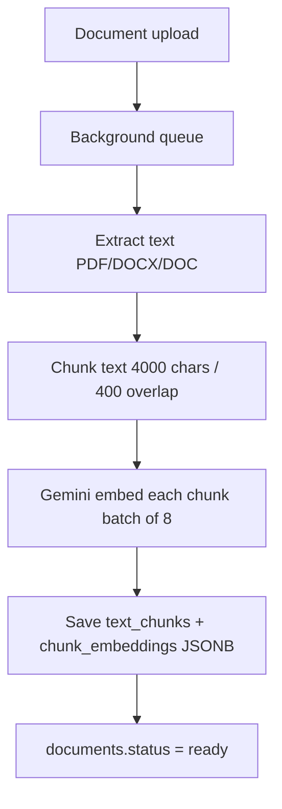
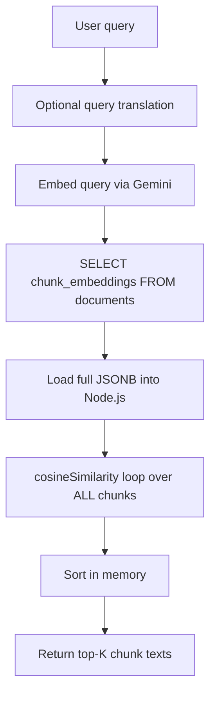
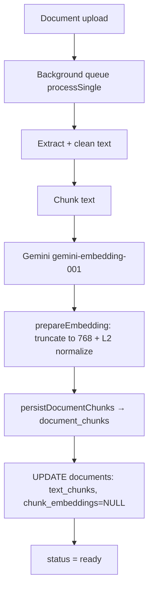
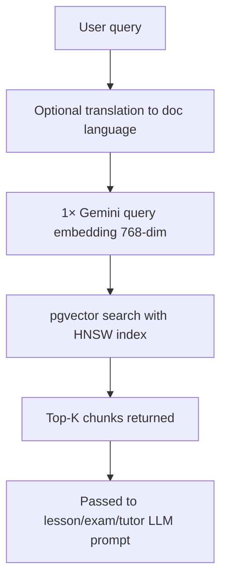

# RAG & Vector Search — Architecture Guide

**Version:** 0.3.0  
**Audience:** Backend engineers, DevOps, and technical stakeholders  
**Scope:** How Eduator stores document embeddings, runs similarity search, and what changed from earlier releases.

Related docs:
- [TECHNICAL_SUMMARY.md](./TECHNICAL_SUMMARY.md) — platform overview
- [DECISIONS.md](./DECISIONS.md) — ADR #10 (pgvector choice)
- [CHANGELOG.md](../CHANGELOG.md) — release **0.3.0**

---

## 1. Executive summary

Eduator uses **Retrieval-Augmented Generation (RAG)** to ground AI outputs (lessons, exams, education plans, tutor chat) in uploaded teaching documents.

| | **≤ 0.2.9 (legacy)** | **0.3.0+ (current)** |
|---|----------------------|----------------------|
| **Vector technology** | None — JSONB arrays in PostgreSQL | **pgvector** extension |
| **Storage** | `documents.chunk_embeddings` (JSONB blob) | `document_chunks.embedding` (`vector(768)`) |
| **Search location** | Node.js in-memory loop | PostgreSQL SQL query |
| **Index** | None | **HNSW** (cosine distance) |
| **Multi-document queries** | N sequential loads + N JS similarity passes | **1 query embedding + 1 SQL query** |
| **Embedding model** | Gemini `gemini-embedding-001` (full dims, unnormalized in storage) | Same model, **768-dim truncated + L2-normalized** |

We did **not** adopt a separate vector database (Qdrant, Weaviate, Pinecone, Milvus, Chroma). Vectors stay in the same PostgreSQL instance as the rest of the app data — the smallest migration path that fixes production-scale RAG bottlenecks.

---

## 2. Why RAG exists in Eduator

Without RAG, the LLM only sees the user prompt. With RAG:

1. User uploads a PDF/DOCX/text file.
2. Backend extracts text, splits it into **chunks**.
3. Each chunk gets an **embedding** (numeric vector capturing meaning).
4. On a query (e.g. “generate exam on photosynthesis”), the system finds the **most similar chunks** and passes them to Gemini as context.

RAG is used by:

| Consumer | Service | RAG method | Typical top-K |
|----------|---------|------------|---------------|
| **REST API** | `routes/ai.ts` | `retrieve()` | 5 (configurable) |
| **Lessons** | `lesson-ai.service.ts` | `getRelevantContentFromDocuments()`, `getRelevantChunks()` | 7 |
| **Exams** | `exam-ai.service.ts` | `retrieve()` per document | 5 |
| **Education plans** | `education-plan-ai.service.ts` | `retrieve()` | 5 |
| **AI Tutor chat** | `teacher-chatbot.service.ts` | `retrieveMany()` (batch) | 2 per doc, max 3 docs |

All paths go through **`DocumentRagService`** (`apps/backend/src/services/document-rag.service.ts`).

---

## 3. Legacy architecture (≤ 0.2.9)

### 3.1 Storage model

Everything lived on the **`documents`** row:

```sql
documents (
  ...
  extracted_text   TEXT,
  text_chunks      JSONB,   -- ["chunk1 text", "chunk2 text", ...]
  chunk_embeddings JSONB,   -- [[0.1, 0.2, ...], [0.3, ...], ...]
  chunk_count      INTEGER,
  ...
)
```

- **`text_chunks`**: array of strings (chunk text).
- **`chunk_embeddings`**: nested JSON array of float arrays — one embedding per chunk.
- No separate table, no vector type, no index.

### 3.2 Processing pipeline (legacy)



### 3.3 Search pipeline (legacy)



**Implementation (removed in 0.3.0):**

- `pickTopChunks()` — scored every embedding in JavaScript.
- `cosineSimilarity()` — dot product / L2 norm in a `for` loop.
- Multi-doc: `getRelevantContentFromDocuments()` called `getRelevantChunks()` **once per document** in a `for` loop.

### 3.4 Legacy limitations

| Problem | Impact |
|---------|--------|
| **No vector index** | Every query scanned 100% of chunks — O(n) per document |
| **JSONB blob I/O** | Large documents = multi-MB row reads on every RAG call |
| **CPU in Node.js** | Cosine math on every chunk blocks the event loop under load |
| **N+1 multi-doc pattern** | 5 documents = 5 DB reads + 5 embedding loads + 5 JS scans |
| **AI Tutor** | Up to 3 parallel `retrieve()` calls = 3× full pipelines |
| **Memory** | Default Gemini embeddings are **3072 dimensions** — heavy in JSONB |
| **No cross-doc ranking** | Could not ask “best 10 chunks across my library” efficiently |

This worked for demos and single-user testing. Under concurrent school-admin usage (lessons + tutor + exams), it would **degrade badly**.

### 3.5 Legacy chunking settings (unchanged in 0.3.0)

| Parameter | Value |
|-----------|-------|
| Chunk size | 4000 characters |
| Overlap | 400 characters |
| Min chunk length | 100 characters |
| Strategy | Sentence-boundary aware with overlap carry |
| Embedding batch size | 8 parallel Gemini calls |
| Embedding model | `gemini-embedding-001` |

---

## 4. Current architecture (0.3.0+)

### 4.1 Storage model

Vectors moved to a dedicated indexed table:

```sql
CREATE EXTENSION vector;

CREATE TABLE document_chunks (
  id           UUID PRIMARY KEY,
  document_id  UUID NOT NULL REFERENCES documents(id) ON DELETE CASCADE,
  chunk_index  INTEGER NOT NULL,
  content      TEXT NOT NULL,
  embedding    vector(768) NOT NULL,
  created_at   TIMESTAMPTZ NOT NULL DEFAULT NOW(),
  UNIQUE (document_id, chunk_index)
);

CREATE INDEX idx_document_chunks_document_id ON document_chunks(document_id);
CREATE INDEX idx_document_chunks_embedding_hnsw
  ON document_chunks USING hnsw (embedding vector_cosine_ops);
```

**`documents` row (current):**

| Column | Status in 0.3.0 |
|--------|-----------------|
| `text_chunks` | Still written — cached chunk text for stats / reuse |
| `chunk_embeddings` | **No longer written** (set to `NULL` on re-index); legacy data kept until backfill |
| `chunk_count`, `total_tokens`, etc. | Unchanged |

**Migration file:** `apps/backend/db/migrations/015_pgvector_document_chunks.sql`

### 4.2 Embedding pipeline (current)



**Key files:**

| File | Role |
|------|------|
| `src/ai/gemini.ts` | Calls Gemini `embedContent`, applies `prepareEmbedding()` |
| `src/utils/vector.ts` | `EMBEDDING_DIMENSIONS = 768`, truncate, normalize, `toPgVector()` |
| `src/services/document-rag.service.ts` | Chunking, indexing, search |

**Why 768 dimensions?**

Gemini `gemini-embedding-001` defaults to 3072 dims but supports **Matryoshka Representation Learning (MRL)** — truncating to 768 preserves ~97% quality while using 4× less storage and faster index operations. Google recommends 768, 1536, or 3072.

**Why L2-normalize?**

pgvector cosine distance operator (`<=>`) works best when vectors are normalized. Truncated Gemini dims are not auto-normalized (unlike full 3072), so we normalize in `prepareEmbedding()`.

### 4.3 Search pipeline (current)

**Single document:**

```sql
SELECT content
FROM document_chunks
WHERE document_id = $1
ORDER BY embedding <=> $2::vector   -- cosine distance
LIMIT $3;
```

**Multiple documents (one query):**

```sql
WITH ranked AS (
  SELECT dc.content,
         ROW_NUMBER() OVER (
           PARTITION BY dc.document_id
           ORDER BY dc.embedding <=> $1::vector
         ) AS rn
  FROM document_chunks dc
  INNER JOIN documents d ON d.id = dc.document_id
  WHERE dc.document_id = ANY($2::uuid[])
    AND d.owner_user_id = $3
    AND d.status = 'ready'
)
SELECT content FROM ranked WHERE rn <= $4;
```



### 4.4 Service API (current)

| Method | Purpose |
|--------|---------|
| `processDocumentOnUpload()` | Queue background indexing after upload |
| `retrieve()` | REST `POST /v1/ai/rag/retrieve` — single doc |
| `retrieveMany()` | Batch search, returns `Map<documentId, chunks[]>` |
| `getRelevantChunks()` | Single doc — used by lesson AI |
| `getRelevantContentFromDocuments()` | Multi doc — **one SQL query** |
| `getParsedDocumentText()` | Full text fallback (no vectors) |
| `getDocumentsContent()` | Concatenate full texts |

### 4.5 Lazy backfill from legacy JSONB

Documents indexed before 0.3.0 may still have `chunk_embeddings` in JSONB but no `document_chunks` rows.

On first RAG access, `ensurePgvectorIndex()`:

1. Checks if `document_chunks` count matches expected chunk count.
2. If missing → `tryBackfillFromLegacy()` reads JSONB, truncates/normalizes embeddings, inserts into `document_chunks`.
3. If no legacy embeddings → re-embeds via Gemini and persists.
4. Sets `documents.chunk_embeddings = NULL` after successful index.

No manual migration script required for normal operation — but a **bulk backfill script** is listed under future improvements.

### 4.6 Performance comparison (illustrative)

Assumptions: 1 document, 40 chunks, 768 dims, 5 concurrent users querying different features.

| Metric | Legacy ≤0.2.9 | Current 0.3.0 |
|--------|---------------|---------------|
| Data loaded per query | ~40 × 3072 floats from JSONB | Index probe only |
| Similarity compute | ~40 ops in Node.js | HNSW approximate search in Postgres |
| Multi-doc (5 docs) | 5 sequential pipelines | 1 embed + 1 SQL |
| AI Tutor (3 docs) | 3× `retrieve()` | 1× `retrieveMany()` |
| DB row size growth | Embeddings bloat `documents` row | Vectors in separate rows |
| Delete cleanup | JSONB cleared with row | `ON DELETE CASCADE` on `document_chunks` |

---

## 5. End-to-end data flow (0.3.0)

### Upload → index

```
Web UI upload
  → POST /v1/documents
  → documents row (status: uploaded)
  → DocumentRagService.processDocumentOnUpload()
  → processSingle():
       pdf-parse / mammoth / word-extractor
       chunkText(4000, 400)
       generateChunkEmbeddings() [batch 8]
       persistDocumentChunks() [transaction]
       UPDATE documents (stats, text_chunks, chunk_embeddings=NULL)
       status: ready
```

### Query → retrieve → generate

```
Lesson: POST /v1/ai/lessons/generate
  → getRelevantContentFromDocuments([docIds], userId, topic, 7)
  → ensureDocumentsIndexed() [parallel backfill if needed]
  → 1× query embedding
  → vectorSearchAcrossDocuments()
  → chunks joined → Gemini lesson prompt

Tutor: POST .../messages
  → retrieveMany(userId, docIds, message, 2)
  → 1× query embedding
  → vectorSearchGrouped()
  → context injected into chat prompt
```

---

## 6. Deployment & operations

### 6.1 Requirements

| Requirement | Notes |
|-------------|-------|
| PostgreSQL | Same DB as app (e.g. `eduator_clean`) |
| **pgvector extension** | Must be installed on DB **host** |
| Migration 015 | `015_pgvector_document_chunks.sql` |

### 6.2 Install pgvector (examples)

**Debian/Ubuntu (PostgreSQL 16):**

```bash
sudo apt install postgresql-16-pgvector
sudo systemctl restart postgresql
```

**Docker:** use image with pgvector preinstalled, e.g. `pgvector/pgvector:pg16`.

**Verify:**

```sql
CREATE EXTENSION IF NOT EXISTS vector;
SELECT extversion FROM pg_extension WHERE extname = 'vector';
```

### 6.3 Run migration

```bash
cd apps/backend
npm run db:migrate
```

Expected log: `Applied migration: 015_pgvector_document_chunks.sql`

### 6.4 Verify index health

```sql
-- Chunk count per document
SELECT document_id, COUNT(*) AS chunks
FROM document_chunks
GROUP BY document_id
ORDER BY chunks DESC
LIMIT 10;

-- Index exists
SELECT indexname FROM pg_indexes
WHERE tablename = 'document_chunks';
```

### 6.5 Troubleshooting

| Symptom | Likely cause | Fix |
|---------|--------------|-----|
| `extension "vector" does not exist` | pgvector not installed on DB server | Install package, `CREATE EXTENSION vector` |
| RAG returns first chunks only (fallback) | Index empty, embed failed | Check Gemini key, re-upload or trigger re-process |
| Slow first query on old docs | Lazy backfill running | Normal once; optional bulk backfill |
| Dimension mismatch errors | Mixed legacy 3072 + new 768 | Re-process document or let backfill truncate |

### 6.6 Environment

No new env vars for pgvector — uses existing `DATABASE_URL`.

See `apps/backend/.env.example` for pgvector note.

---

## 7. Security & tenancy

- All RAG queries are **owner-scoped**: `documents.owner_user_id = $userId`.
- Multi-doc SQL joins `documents` and filters by owner before returning chunks.
- Embeddings contain no secrets — they are derived from document text.
- Gemini API keys remain per-user encrypted (`user_ai_provider_keys`).
- Document delete cascades: `DELETE documents` → `document_chunks` rows removed automatically.

---

## 8. What we deliberately did NOT use

| Technology | Why not (for now) |
|------------|-------------------|
| **Qdrant** | Extra service, ops overhead, network hop |
| **Weaviate** | Same — separate cluster to manage |
| **Pinecone** | SaaS cost + data residency |
| **Milvus** | Heavier infra for current scale |
| **Chroma** | Embedded DB — still another dependency |
| **LangChain vector stores** | App already has custom RAG; adds abstraction weight |

**pgvector** was chosen because we already run PostgreSQL, backups are unified, and tenant isolation stays in SQL.

See [DECISIONS.md](./DECISIONS.md) §10.

---

## 9. Future roadmap

Ordered roughly by **impact vs effort**.

### 9.1 Near term (low effort, high value)

| Item | Description |
|------|-------------|
| **Bulk backfill script** | One-time `scripts/backfill-document-chunks.ts` for all legacy docs instead of lazy-on-query |
| **Drop `chunk_embeddings` column** | After backfill complete, migration to remove legacy JSONB column |
| **Re-process stale indexes** | If chunk text changes (`extracted_text` hash mismatch), auto re-index |
| **HNSW tuning** | Adjust `m`, `ef_construction` at index build for recall/latency tradeoff |
| **Query embedding cache** | Short TTL cache for identical queries in same conversation |

### 9.2 Medium term (quality improvements)

| Item | Description |
|------|-------------|
| **Hybrid search** | Combine pgvector similarity + PostgreSQL full-text (`tsvector`) for keyword-heavy queries |
| **Re-ranking** | Retrieve top-20 with HNSW, re-rank top-5 with cross-encoder or Gemini rerank |
| **Chunk metadata** | Store page number, section heading, source filename on `document_chunks` |
| **Task-specific embeddings** | Pass Gemini `taskType: RETRIEVAL_DOCUMENT` / `RETRIEVAL_QUERY` when SDK supports it |
| **Smarter chunking** | Structure-aware splits (headings, tables) instead of char-count only |
| **IVFFlat fallback** | For very large corpora where HNSW memory is costly — build IVFFlat index instead |

### 9.3 Long term (scale-out options)

| Item | When to consider |
|------|------------------|
| **Dedicated vector DB (Qdrant/Weaviate)** | Millions of chunks, sub-10ms p99 at high QPS, multi-region |
| **Cross-user / org-wide search** | “Search all documents in school” — needs tenant-aware global index |
| **Multi-modal RAG** | Embed images/diagrams from PDFs (Gemini multimodal embeddings) |
| **Embedding version migration** | New model → background re-embed job with `embedding_model_version` column |
| **Read replicas** | Heavy RAG read load off primary PostgreSQL |
| **Sharding by tenant** | Large SaaS scale — partition `document_chunks` by `owner_user_id` or org |

### 9.4 Decision triggers for leaving pgvector

Consider a dedicated vector database when **any** of these become true:

- \> **500K–1M** chunks and HNSW index RAM exceeds DB budget
- p99 RAG latency **\> 200ms** despite index tuning
- Need **global semantic search** across all tenants with complex filtering
- PostgreSQL CPU consistently **\> 70%** due to vector queries under concurrent AI load

Until then, pgvector in PostgreSQL is the right balance for Eduator.

---

## 10. File reference

| Path | Description |
|------|-------------|
| `apps/backend/db/migrations/015_pgvector_document_chunks.sql` | pgvector schema + HNSW index |
| `apps/backend/db/migrations/000_full_schema.sql` | Fresh install includes `document_chunks` |
| `apps/backend/src/services/document-rag.service.ts` | Core RAG service |
| `apps/backend/src/utils/vector.ts` | 768-dim normalize + pg format |
| `apps/backend/src/ai/gemini.ts` | Embedding generation |
| `apps/backend/src/services/lesson-ai.service.ts` | Lesson RAG consumer |
| `apps/backend/src/services/exam-ai.service.ts` | Exam RAG consumer |
| `apps/backend/src/services/education-plan-ai.service.ts` | Plan RAG consumer |
| `apps/backend/src/services/teacher-chatbot.service.ts` | Tutor batch RAG consumer |
| `apps/backend/src/routes/ai.ts` | `POST /v1/ai/rag/retrieve` |

---

## 11. Glossary

| Term | Meaning |
|------|---------|
| **RAG** | Retrieval-Augmented Generation — fetch relevant text before LLM call |
| **Embedding** | Fixed-size float vector representing text meaning |
| **Chunk** | Segment of document text (~4000 chars) used as retrieval unit |
| **pgvector** | PostgreSQL extension adding `vector` type and similarity operators |
| **HNSW** | Hierarchical Navigable Small World — approximate nearest neighbor index |
| **Cosine distance** | pgvector `<=>` operator; lower = more similar (for normalized vectors) |
| **top-K** | Number of best-matching chunks returned |
| **MRL** | Matryoshka Representation Learning — quality-preserving dimension truncation |
| **Lazy backfill** | Migrate legacy JSONB embeddings to `document_chunks` on first access |

---

## 12. Version history (RAG-specific)

| Version | Date | RAG change |
|---------|------|------------|
| **≤ 0.2.9** | May 2026 | JSONB embeddings, in-memory cosine similarity |
| **0.3.0** | 22 May 2026 | pgvector `document_chunks`, HNSW index, batch multi-doc search, 768-dim normalized embeddings |

---

*Last updated: release **0.3.0** — pgvector RAG migration.*
