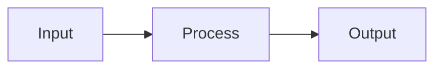
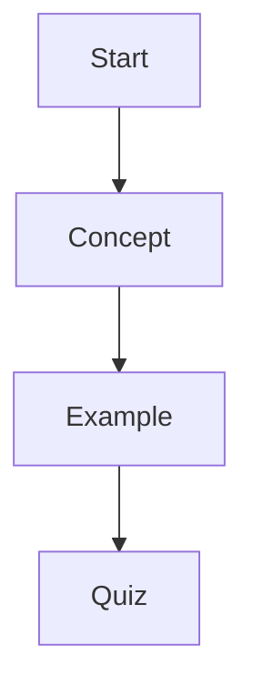

# Lesson View Rendering Guide

## Purpose

This document explains, in a simple and practical way, how Lesson View works in this project:

- what libraries we use
- how AI lesson markdown is generated
- how it is saved in the database
- how tables, math, diagrams, and code blocks are rendered

Use this document when sharing the system with other developers or teams.

---

## Quick Architecture (End-to-End)

1. Teacher sends lesson generation request.
2. Backend calls AI generator with RAG context from documents.
3. AI returns structured JSON with markdown content.
4. Backend stores lesson in DB (`lessons` table), especially `content.text`.
5. Student/Teacher Lesson page loads lesson from DB.
6. UI components render content tabs, markdown, math, tables, diagrams, images, and mini-test.

---

## Core Libraries and Tools

### App and UI

- `Next.js` + `React` for app pages and components
- `next-intl` for translations
- `lucide-react` for icons

### Data and Auth

- `Supabase` for auth and PostgreSQL data access

### AI Generation

- `@google/generative-ai` (Gemini) in `packages/ai`
- custom RAG helpers to retrieve relevant document chunks

### Rendering Features

- custom markdown-to-HTML formatting in `LessonContent`
- math rendering via `renderLatexInHtml`
- Mermaid diagram rendering via dynamic `mermaid` import
- styled code blocks (`pre/code`) for terminal/code look

---

## Where Each Part Lives

- Lesson generation API:
  - `apps/erp-app/src/app/api/teacher/lessons/generate/route.ts`
- AI lesson generator:
  - `packages/ai/src/services/lesson-generator.ts`
- DB lesson repository:
  - `packages/db/src/repositories/lessons.ts`
- Student lesson page:
  - `apps/erp-app/src/app/student/lessons/[id]/page.tsx`
- Teacher lesson page:
  - `apps/erp-app/src/app/teacher/lessons/[id]/page.tsx`
- Shared lesson data mapper:
  - `apps/erp-app/src/lib/lesson-view.ts`
- Main lesson UI tabs:
  - `packages/ui/src/components/lessons/lesson-tabs.tsx`
- Markdown/math/diagram renderer:
  - `packages/ui/src/components/lessons/lesson-content.tsx`

---

## AI Output Format We Use

AI is instructed to return strict JSON, not free text.

```json
{
  "title": "Lesson title",
  "learning_objectives": ["Objective 1", "Objective 2"],
  "content": "Markdown lesson body",
  "examples": [
    { "title": "Example", "description": "Details", "code": "optional" }
  ],
  "mini_test": [
    {
      "question": "Question?",
      "options": ["A", "B", "C", "D"],
      "correct_answer": 0,
      "explanation": "Why A is correct"
    }
  ]
}
```

The `content` field is markdown (not a `.md` file on disk).

---

## How Lesson Content Is Saved in DB

In our repository logic, content is stored in the `lessons` table as JSON object:

- `content: { text: "<markdown string>" }`
- `images: [...]`
- `mini_test: [...]`
- `learning_objectives: [...]`
- `metadata.examples: [...]`

This makes it easy to version and render consistently across teacher and student views.

In app pages, `mapLessonToViewData()` is used to normalize DB payloads into one stable UI contract:

- always returns a safe text value for `contentText`
- normalizes optional arrays (`images`, `mini_test`, `learning_objectives`, `metadata.examples`)
- reads display options like `metadata.generation_options.centerText`

---

## Rendering Rules and Feature Support

### 1) Markdown Sections

Supported:

- headings: `#`, `##`, `###`
- paragraphs
- bullet and numbered lists
- inline bold/italic/code

### 2) Tables

Use standard markdown table format:

```md
| Concept | Description | Example |
| --- | --- | --- |
| Derivative | Rate of change | d/dx (x^2) = 2x |
| Integral | Area under curve | ∫ x dx = x^2/2 + C |
```

### 3) Math

Preferred:

- inline: `$a^2 + b^2 = c^2$`
- block: `$$\int_0^1 x^2 dx = \frac{1}{3}$$`

Also supported in text:

- subscript/superscript style content where needed

### 4) Diagrams (Mermaid)

Use fenced mermaid blocks:

````md

````

### 5) Code / Terminal View

Use fenced code blocks:

````md
```bash
npm run build
npm run start
```
````

Renderer displays these in styled monospace blocks.

---

## Clean Authoring Guidelines (Important for Shared Projects)

To help less-technical teams use lessons easily:

- Keep one language per lesson.
- Use short sections and short paragraphs.
- Prefer simple headings and bullets.
- Use tables for comparisons only.
- Use diagrams only when needed.
- Avoid raw JSON in lesson content body.
- Avoid AI meta text/disclaimers in final content.

---

## Minimal Copy-Paste Lesson Template

```md
# Lesson Title

## Learning Objectives
- Understand ...
- Apply ...
- Compare ...

## Core Concepts
Short explanation.

## Worked Example
Step-by-step explanation.

## Comparison Table
| Item | Meaning | Example |
| --- | --- | --- |
| A | ... | ... |

## Diagram


## Quick Practice
1. Question one
2. Question two
```

---

## Why This Approach Is Reusable

- AI output is normalized to stable JSON shape.
- DB model is simple (`content.text` + structured arrays).
- UI renderer supports rich educational content without requiring users to understand raw markdown deeply.
- Same lesson data works for both teacher and student interfaces.

This is the recommended format when sharing lesson technology with other teams/projects.

---

## Unique Value Proposition (Why Teams Choose This)

- **One lesson payload, multiple outputs:** same data powers teacher view, student view, audio, and quizzes.
- **Education-first rendering:** built-in support for math, tables, diagrams, and learning objectives.
- **Resilient AI ingestion:** JSON parsing fallbacks and content normalization reduce broken AI outputs.
- **Low-friction adoption:** external teams can start with markdown + JSON and get a polished UI fast.

---

## Integration Contract (Copy This to Other Projects)

When another team integrates this renderer, require this contract:

1. Lesson JSON must include:
   - `title` (string)
   - `content` (markdown string)
   - `learning_objectives` (string array)
   - `mini_test` (array)
2. Save markdown as:
   - `content: { text: "<markdown>" }`
3. Use fenced blocks for advanced content:
   - code: ```` ```bash ... ``` ````
   - diagrams: ```` ```mermaid ... ``` ````
4. Keep content language consistent (one language per lesson).
5. Do not put raw JSON inside the markdown body.

If these rules are followed, lesson view will stay clean and predictable.

---

## What Is Truly Production-Ready vs Needs Care

### Production-Ready Today

- heading/list/table markdown rendering
- LaTeX rendering in lesson body
- Mermaid diagram support with fallback retry logic
- image sections (top/middle/bottom) + fullscreen view
- mini-test UI with answer checking and explanations

### Needs Care During Integration

- this is a custom markdown parser (not full CommonMark/GFM coverage)
- very malformed Mermaid from AI may still fail
- custom HTML is rendered with `dangerouslySetInnerHTML`, so escaping/sanitization must remain strict
- very large lessons can impact client-side render time

---

## Acceptance Checklist for External Teams

Use this checklist before saying "integration complete":

- [ ] Lesson title renders correctly.
- [ ] 2-3 markdown headings appear in table of contents.
- [ ] One markdown table renders as table (not plain text).
- [ ] One LaTeX inline + one block formula render correctly.
- [ ] One Mermaid diagram renders (or shows readable fallback error).
- [ ] One fenced code block renders in styled monospace view.
- [ ] Mini-test shows options and score logic works.
- [ ] No raw AI disclaimer/meta text is visible in final lesson.

---

## Recommended "Share Package" for Non-Technical Partners

When sending lessons to less-technical users, share:

1. `lesson.html` (primary, easy open in browser)
2. `lesson.pdf` (print/share ready)
3. `lesson.md` (optional, advanced)
4. `START-HERE.txt` with 3 short instructions

This prevents confusion and makes adoption faster than sharing only raw markdown.
